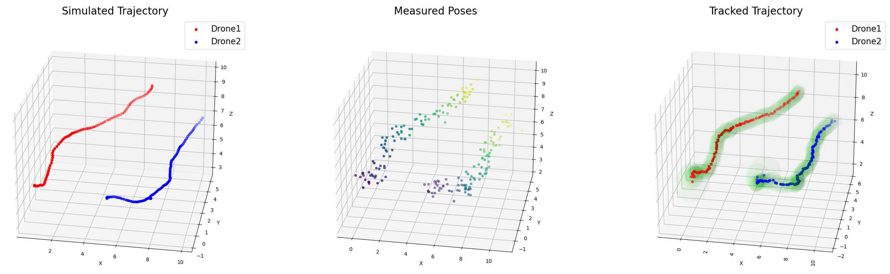

# Multi-Object Tracking with Kalman Filter

Kalman Filter is hands-down the best algorithm for estimating hidden state variables given the measurements observed over time. The have demonstrated to be extremely effective in various use-cases such as object tracking, and sensor fusion. Kalman Filter is a special case of Recursive Bayesian Filters and assumes the data to follow multi-variate Gaussian distribution. Consequently, they only work for linear transition models and linear measurement models. While dealing with a non-linear functions, we need to linearize them first using Taylor Series Approximation - this variant of Kalman Filter is called Extended Kalman Filter.

This algorithm consists of two major steps: (1) Prediction, and (2) Update/Correction. During the prediction step, we forecast the tracked state one time step forward through the linear transition model and propagate measurement errors. A measurement model is then used to cast observations onto a measured state. We then compute Kalman Gain which is a function of our prediction, measurement, and error covariances. This Kalman Gain is then used to correct our belief about the actual object state - much like Recursive Bayesian Filter where we use prior belief and measurements to estimate the posterior belief function.

An essential component required for multi-object tracking is the object association, which is necessary to associate each measurement with an object being tracked by our filter. The most trivial function used for association would be to first compute the euclidean distance between each measurement and every other tracked object, and then associate the measurement with the object at the smallest distance if this distance is under some threshold. More sophisticated methods uses Hungarian Algorithm or other statistical distance to do this association.

In this work, Mahalanobis Distance is used to compute the distance between measurements and tracked objects. If the smallest distance is within 3*σ of the estimated mean, then that object is deemed as a correct match. If no match is found, then a new track is instantiated; and similarly, if no updates have been received for any tracked object for over 100 milliseconds, then that object track is deleted.

In the figure, noisy measurements are received for two Drones, which are tracked by the filter. Red and Blue dots show the tracked mean of Drone1 and Drone2 respectively, and green ellipsoids show uncertainty in x,y,z.